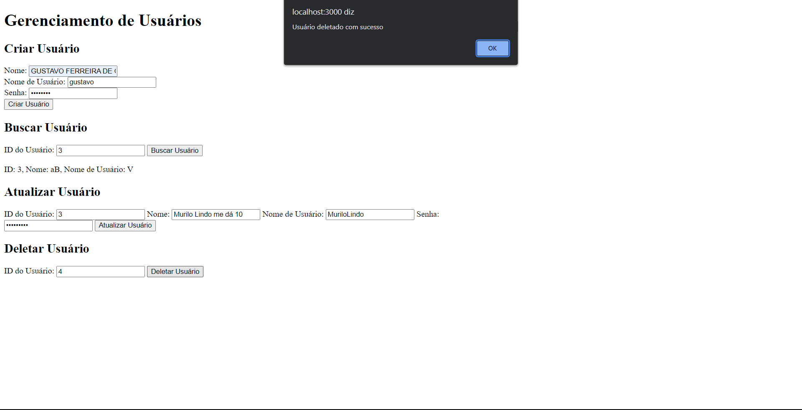

# Avaliacoes-M7-Inteli



# Estrutura do Docker
1. Docker na pasta frontend, para genrencia o front-end.
2. Docker na pasta backend, para genrencia o back-end.
3. Um docker compose na pasta raiz para gerenciar ambas as partes.
   
Para rodar o projeto por meio do github, após clonar o repósitorio:
1. Na pasta raiz do projeto, rode o comando:
   ```cocker compose up```
   
2. Após a execução do compose, o projeto será executado

2. Caso queria fazer o deploy de alteração para o meu hub, rode os comandos:
   1. ```cocker compose build```

    2. ```cocker compose push```

# Estrutra e escolhas:

## Docker Compose
A estrutura utilizada é a mesma que criei para a utilização nas ponderadas, pois é a forma automazidade de gerar as imagens e container para essa finalidade. Essa estrutura é feita, com base nas minhas experiencias anteriores ao modulo atual, ao qual julgo achar melhor para o projeto. Onde posso fazer a publicação direta no docker hub ou até mesmo utilizar localmente.

## Docker file
Os dockerfiles possuir a estrutura padrão utilizado e apresentado durante as aulas, dessa forma, tornando mais simples a correção e também por ser a padrão utilizada em outros projetos e por outros devs.

# Dockerhub

1 - Front-end

[https://hub.docker.com/repository/docker/gustavofdeoliveira/frontend-avaliacoes-m7-inteli/general](https://hub.docker.com/repository/docker/gustavofdeoliveira/frontend-avaliacoes-m7-inteli/general)

2 - Back-end

[https://hub.docker.com/repository/docker/gustavofdeoliveira/backend-avaliacoes-m7-inteli/general](https://hub.docker.com/repository/docker/gustavofdeoliveira/backend-avaliacoes-m7-inteli/general)
